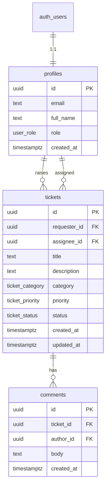

# CHMS Support Desk

Internal support ticketing application built for the CHMS Cybersec technical exercise. Staff raise tickets; support agents manage them through to resolution.

| | |
|---|---|
| **Live app** | _Add your Vercel URL after deploy_ |
| **Source** | https://github.com/ibrahim-qi/chms-support-desk |

## Demo accounts

Register these via the app (or use your own test accounts). Set the agent role in Supabase after signup.

| Email | Role | Notes |
|-------|------|-------|
| `requester@demo.local` | Requester | Raises and tracks own tickets |
| `agent@demo.local` | Agent | Run SQL below after registering |

```sql
update public.profiles
set role = 'agent'
where email = 'agent@demo.local';
```

For local demo, disable **Confirm email** in Supabase → Authentication → Providers → Email.

---

## Stack and rationale

| Layer | Choice | Why |
|-------|--------|-----|
| Framework | Next.js App Router | Server Components for reads, Server Actions for writes, deploys cleanly on Vercel |
| Database & auth | Supabase (Postgres + Auth) | Managed Postgres with Row-Level Security on the free tier |
| UI | shadcn/ui + Tailwind | Consistent internal-tool UI without a custom design system |
| Hosting | Vercel Hobby | Free tier, matches Next.js stack |

No ORM, no client data library — the Supabase client plus RLS keeps the data path easy to explain.

---

## Data model

Three tables extend Supabase Auth:



**Enums:** `user_role` (requester, agent), `ticket_status` (open, in_progress, resolved, closed), `ticket_priority`, `ticket_category`.

Schema and RLS live in `supabase/migrations/001_initial_schema.sql`. Migration `002_prevent_role_escalation.sql` adds a trigger so users cannot change their own `role` via the API.

If you already ran `001` before this trigger existed, also run `002` in the Supabase SQL Editor.

---

## Authentication

- Email/password via Supabase Auth
- Session stored in HTTP-only cookies via `@supabase/ssr`
- `middleware.ts` refreshes the session on each request
- On signup, a trigger creates a `profiles` row with role `requester`

---

## Authorization and RLS

Security is enforced in **Postgres**, not only in the UI. The anon key is public; RLS runs every query as the signed-in user.

### Helper functions

- `current_user_role()` — reads role from `profiles`
- `is_agent()` — true when role is agent
- `can_view_ticket(ticket_id)` — used by comment policies

### Policy summary

| Table | Operation | Who |
|-------|-----------|-----|
| `profiles` | SELECT | Own row; agents see all (for assignment dropdown) |
| `profiles` | UPDATE | Own row only (`full_name`; role is not user-editable) |
| `tickets` | SELECT | Requester: own tickets; agent: all |
| `tickets` | INSERT | Authenticated; `requester_id` must equal `auth.uid()` |
| `tickets` | UPDATE | Agents only |
| `comments` | SELECT / INSERT | Visible if parent ticket is visible; `author_id = auth.uid()` on insert |

Unauthorized access returns **no rows** — the app shows a generic not-found page rather than leaking whether a ticket ID exists.

---

## Ticket workflow

```
Open → In Progress → Resolved → Closed
```

- New tickets default to **Open**
- Only **agents** can change status or assign an ticket
- Valid transitions are checked in `src/lib/tickets/workflow.ts` and in Server Actions
- Requesters can view their tickets and add comments

---

## Application structure

```
src/
├── app/
│   ├── (auth)/          login, register
│   ├── (app)/           sidebar layout
│   │   ├── tickets/     queue, new, detail
│   │   └── dashboard/   agent status counts
│   └── actions/         Server Actions (auth, tickets, comments)
├── components/          UI + feature components
├── lib/
│   ├── supabase/        browser/server clients, middleware helper
│   ├── auth/            getProfile()
│   └── tickets/         queries, workflow, constants
└── middleware.ts        session refresh + route protection
```

**Request flow:** Browser → Server Component or Server Action → Supabase (JWT in cookie) → RLS-filtered Postgres → HTML response.

---

## Local setup

### 1. Clone and install

```bash
git clone https://github.com/ibrahim-qi/chms-support-desk.git
cd chms-support-desk
npm install
```

### 2. Environment variables

Copy `.env.local.example` to `.env.local`:

```env
NEXT_PUBLIC_SUPABASE_URL=https://your-project.supabase.co
NEXT_PUBLIC_SUPABASE_PUBLISHABLE_KEY=your-publishable-or-anon-key
```

### 3. Database

In the Supabase SQL Editor, run the full contents of:

```
supabase/migrations/001_initial_schema.sql
```

### 4. Auth settings

In Supabase Dashboard → Authentication → Providers → Email, disable **Confirm email** for frictionless local/demo signup.

### 5. Run

```bash
npm run dev
```

Open http://localhost:3000 — register demo users, promote agent via SQL above.

---

## Deployment (Vercel)

1. Push the repo to GitHub
2. Import the project at [vercel.com/new](https://vercel.com/new)
3. Add the same two environment variables as `.env.local`
4. Deploy

**Before your demo:** Supabase free projects pause after ~7 days of inactivity. Open the live app shortly before the interview so the project is awake.

---

## Key decisions and trade-offs

| Decision | Trade-off |
|----------|-----------|
| Server Actions over API routes | Less boilerplate; mutations colocated with the app |
| RLS as the security boundary | Policies must be correct in SQL; very strong server-side guarantee |
| Status validation in app layer | Faster to ship; a DB trigger would harden this in production |
| Priority sort in memory | Fine for small queues; would move to SQL `CASE` at scale |
| No stretch features | Skipped admin, attachments, audit log, notifications to stay focused |

---

## If I had more time

- Audit log table for status and assignment changes
- DB trigger to enforce workflow transitions
- Pagination on the ticket queue
- Email notifications on assignment
- Regenerate TypeScript types from Supabase CLI

---

## License

Built as an original technical exercise submission for CHMS Cybersec. Not derived from any open-source help-desk system.
