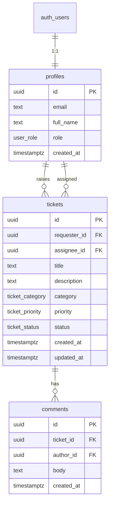

# CHMS Support Desk

An internal support ticketing system for staff to raise IT and operational issues, and for support agents to manage them through to resolution.

| | |
|---|---|
| **Live app** | https://chms-support-desk.vercel.app |
| **Repository** | https://github.com/ibrahim-qi/chms-support-desk |

**Contents:** [Overview](#overview) · [Stack](#stack-and-rationale) · [Data model](#data-model) · [Authentication](#authentication) · [Authorization & RLS](#authorization-and-rls) · [Workflow](#ticket-workflow) · [Project structure](#project-structure) · [Local setup](#local-setup) · [Deployment](#deployment) · [Trade-offs](#key-decisions-and-trade-offs) · [Roadmap](#future-enhancements)

---

## Overview

CHMS Support Desk is a web application for a small organisation’s internal help desk. Users sign in, raise tickets with a title, description, category, and priority, and track progress. Support agents work from a shared queue, assign tickets, move them through a defined lifecycle, and collaborate via comments.

### User roles

| Role | Capabilities |
|------|----------------|
| **Requester** | Register, sign in, raise tickets, view own tickets, filter and sort the personal queue, add comments on own tickets |
| **Support agent** | Everything a requester can do, plus: view the full ticket queue, assign tickets, update status, access the status dashboard |

New accounts are created as requesters. Agent access is assigned in the database (see [Test accounts](#test-accounts)).

### Core features

- Email/password authentication (Supabase Auth)
- Role-based access enforced in Postgres (Row-Level Security)
- Ticket queue with status filters and sorting
- Ticket detail with comment timeline
- Agent workflow: Open → In Progress → Resolved → Closed
- Agent dashboard with ticket counts by status

---

## Stack and rationale

| Layer | Choice | Why |
|-------|--------|-----|
| Framework | Next.js App Router | Server Components for reads, Server Actions for writes; straightforward deployment on Vercel |
| Database & auth | Supabase (Postgres + Auth) | Managed Postgres with Row-Level Security; auth and database in one service |
| UI | shadcn/ui + Tailwind CSS | Consistent, accessible internal-tool UI without a custom design system |
| Hosting | Vercel | Native Next.js support; environment-based configuration |

The application uses the Supabase JavaScript client directly — no ORM or client-side data library. Every query carries the signed-in user’s JWT; Row-Level Security in Postgres is the authoritative access-control layer. This keeps the data path simple to audit and maintain.

**Request flow:**

```
Browser → Server Component / Server Action → Supabase (session cookie) → RLS → Postgres → HTML
```

---

## Data model

Three application tables extend Supabase Auth. When a user registers, a trigger creates a matching row in `profiles`.



**Design notes:**

- **`profiles`** stores each user’s role (`requester` or `agent`) in Postgres, not only in application code.
- **`tickets`** holds workflow state with explicit `requester_id` and `assignee_id` foreign keys.
- **`comments`** are normalised into their own table so the activity timeline scales independently of the ticket record.

**Enums:** `user_role`, `ticket_status` (`open`, `in_progress`, `resolved`, `closed`), `ticket_priority`, `ticket_category`.

### Database migrations

Apply these in order via the Supabase SQL Editor (`supabase/migrations/`):

| File | Purpose |
|------|---------|
| `001_initial_schema.sql` | Tables, indexes, RLS policies, profile signup trigger |
| `002_prevent_role_escalation.sql` | Prevents users from changing their own `role` through the API |
| `003_restrict_agent_ticket_updates.sql` | Restricts agent ticket updates to `status` and `assignee_id` only |

If `001` was applied before `002` or `003` existed, run those files separately.

---

## Authentication

- Email and password sign-up and sign-in via Supabase Auth
- Session stored in HTTP-only cookies using `@supabase/ssr`
- Middleware refreshes the session on each request and redirects unauthenticated users away from protected routes (`/tickets`, `/dashboard`)
- On registration, a database trigger creates a `profiles` row with role `requester`

---

## Authorization and RLS

The Supabase anon (publishable) key is public by design. **Access control is enforced in Postgres**, not by hiding buttons in the user interface.

Each query runs as the signed-in user. RLS policies determine which rows can be read or written. The application layer adds role checks and business rules (such as valid status transitions); RLS is the security boundary.

### Application helpers

Defined in `src/lib/auth/authorization.ts`:

| Helper | Purpose |
|--------|---------|
| `getAuthenticatedProfile()` | Validates session for Server Actions available to any signed-in user |
| `getAgentProfile()` | Validates session and agent role for agent-only mutations |
| `requireAgentPageAccess()` | Protects the dashboard page |
| `isAgent()` | Drives role-aware navigation and UI |

Middleware redirects non-agents away from `/dashboard`. If a profile lookup fails due to a transient error, the request proceeds and the page-level check applies.

### Postgres helper functions

| Function | Purpose |
|----------|---------|
| `current_user_role()` | Returns the signed-in user’s role from `profiles` |
| `is_agent()` | Used in RLS policies to identify support agents |
| `can_view_ticket(ticket_id)` | Determines whether the user may access a ticket’s comments |

### RLS policy summary

| Table | Operation | Access |
|-------|-----------|--------|
| `profiles` | SELECT | Own profile; agents can read all profiles (for assignment) |
| `profiles` | UPDATE | Own profile only (`full_name`); role changes blocked by trigger |
| `tickets` | SELECT | Requesters: own tickets; agents: all tickets |
| `tickets` | INSERT | Authenticated users; `requester_id` must equal the signed-in user |
| `tickets` | UPDATE | Agents only; database trigger limits updatable columns |
| `comments` | SELECT / INSERT | Parent ticket must be visible to the user; author must be the signed-in user |

When a user requests a ticket they cannot access, RLS returns no rows. The application responds with a generic **not-found** page rather than an explicit “access denied”, so ticket IDs are not leaked to unauthorised users.

---

## Ticket workflow

```
Open → In Progress → Resolved → Closed
```

| Rule | Enforced by |
|------|-------------|
| New tickets default to **Open** | Database default |
| Only agents may change status or assign tickets | RLS + Server Actions |
| Transitions are forward-only (no skipping or reversing) | `src/lib/tickets/workflow.ts` + Server Actions |
| Requesters may view their tickets and add comments | RLS policies |

On the ticket detail page, agents see a workflow panel for status and assignment. Requesters see ticket details and the comment timeline only.

---

## Project structure

```
src/
├── app/
│   ├── (auth)/          Login and registration
│   ├── (app)/           Authenticated shell: dashboard, ticket queue, detail
│   └── actions/         Server Actions (auth, tickets, workflow, comments)
├── components/          Layout, ticket UI, shared form feedback, shadcn/ui
├── lib/
│   ├── supabase/        Browser/server clients, middleware session helper
│   ├── auth/            Profile loading (cached per request), authorization
│   ├── form.ts          Shared FormData parsing and enum validation
│   └── tickets/         Queries, workflow rules, constants, validation
└── middleware.ts        Session refresh and route protection
```

- **Reads:** Server Components calling `src/lib/tickets/queries.ts`
- **Writes:** Server Actions in `src/app/actions/`
- **Business rules:** `src/lib/tickets/workflow.ts`

---

## Local setup

### Prerequisites

- Node.js 20 or later
- npm
- A Supabase project ([supabase.com](https://supabase.com))

### 1. Clone and install

```bash
git clone https://github.com/ibrahim-qi/chms-support-desk.git
cd chms-support-desk
npm install
```

### 2. Environment variables

Copy `.env.local.example` to `.env.local` and set:

| Variable | Description |
|----------|-------------|
| `NEXT_PUBLIC_SUPABASE_URL` | Project URL from Supabase → Settings → API |
| `NEXT_PUBLIC_SUPABASE_PUBLISHABLE_KEY` | Publishable (anon) key from the same page |

### 3. Database

Run the migration files in the Supabase SQL Editor (see [Database migrations](#database-migrations)).

### 4. Auth settings

In Supabase → Authentication → Providers → Email, disable **Confirm email** if you want immediate sign-in after registration (recommended for development and staging).

### 5. Run the application

```bash
npm run dev
```

Open [http://localhost:3000](http://localhost:3000).

### npm scripts

| Command | Description |
|---------|-------------|
| `npm run dev` | Start the development server |
| `npm run build` | Production build |
| `npm run start` | Run the production build locally |
| `npm run lint` | Run ESLint |

### Test accounts

Register users through the application, then promote an agent in the Supabase SQL Editor:

```sql
update public.profiles
set role = 'agent'
where email = 'agent@demo.local';
```

Suggested test accounts: `requester@demo.local` (requester) and `agent@demo.local` (agent, after running the SQL above).

---

## Deployment

Deploy to [Vercel](https://vercel.com/new) connected to the GitHub repository.

1. Import the repository
2. Set `NEXT_PUBLIC_SUPABASE_URL` and `NEXT_PUBLIC_SUPABASE_PUBLISHABLE_KEY` as environment variables
3. Deploy
4. Update the **Live app** link at the top of this document

**Supabase free tier:** Projects pause after approximately seven days of inactivity. If the application fails to load, open the Supabase dashboard or send a request to the deployed URL to wake the project.

---

## Key decisions and trade-offs

| Decision | Rationale | Trade-off |
|----------|-----------|-----------|
| Server Actions over REST API routes | Less boilerplate; mutations live alongside the UI for a focused internal tool | A public REST API would require a separate layer |
| RLS as the security boundary | Enforced on every query, including direct database API access | Policies must be maintained carefully in SQL |
| Agent UPDATE trigger (migration 003) | Prevents agents from rewriting ticket content via the database API | Status transition rules are still validated in application code |
| Status transitions in application code | Centralised, easy to read and change in one TypeScript module | Direct API calls could bypass transition rules until a database trigger is added |
| Priority sort in application memory | Acceptable for small ticket volumes | At scale, use SQL ordering and pagination |
| Status sort via dropdown | Clear, accessible filtering without custom table behaviour | Differs from sortable column headers in some enterprise tools |

---

## Future enhancements

Planned improvements for a production deployment:

- Audit log for status changes and assignments
- Database trigger to enforce workflow transitions
- Pagination and search on the ticket queue
- Email notifications when a ticket is assigned
- TypeScript types generated from the Supabase schema (`supabase gen types`)

---

## Troubleshooting

| Issue | Resolution |
|-------|------------|
| Sign-up succeeds but sign-in fails | Disable **Confirm email** in Supabase Auth settings, or confirm the address via email |
| Agent cannot access the dashboard | Confirm `profiles.role = 'agent'` for that user in the SQL Editor |
| User cannot promote themselves to agent | Expected — migration `002` blocks self-service role changes; update role via SQL Editor or admin process |
| Application loads slowly or times out | Supabase free-tier project may be paused; open the Supabase dashboard to wake it |
| RLS errors after initial setup | Ensure migrations `001`, `002`, and `003` have all been applied |
| Policies missing in Supabase | Re-run `001_initial_schema.sql` or verify policies under Authentication → Policies |

---

## License

Copyright © 2026. All rights reserved.
